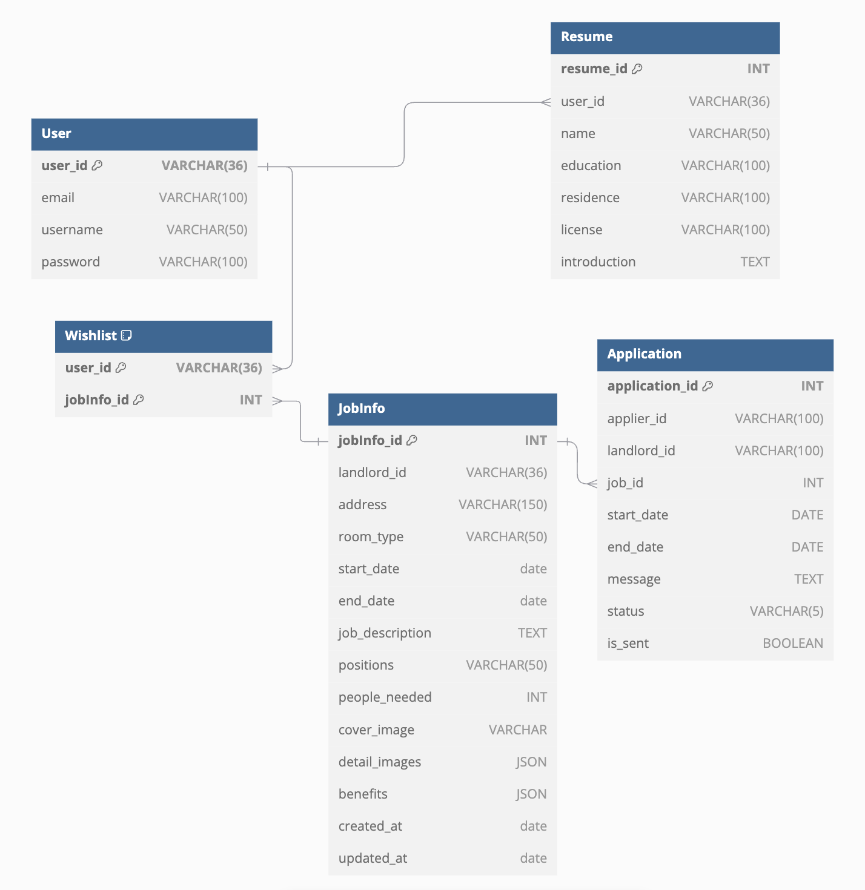

DB

1. User (打工換宿申請人或房東)
   欄位：email、username、password、user_id (pk)
   說明：此表儲存打工換宿平台上一般用戶的基本資料，包含電子郵件、用戶名、密碼等資訊。user_id 是該表的主鍵，用於唯一識別每位用戶。

2. Resume (履歷)
   欄位：resume_id (pk)、user_id (fk)、name、birthdate、education、residence、license、introduction
   說明：此表儲存每位用戶的詳細履歷信息，包括姓名、生日、學歷、居住地、證照及自我介紹等。user_id 是外鍵 (foreign key)，連結到 User 表，表示這份履歷屬於哪位用戶。resume_id 是主鍵，用於唯一識別每份履歷。

3. JobInfo (打工換宿介紹)
   欄位：jobInfo_id (pk)、landlord_id (fk)、address、room_type、start_date、end_date、job_description、positions、people_needed
   說明：此表描述每個房東的打工換宿資訊，包含地址、房型、日期、工作內容、職缺名稱、所需人數等。landlord_id 是外鍵，連結到 User 表，表示該工作資訊由哪位房東提供。jobInfo_id 是主鍵，用於唯一識別每項打工換宿資訊。

4. Application (申請)
   欄位：application_id (pk)、owner_id (fk)、applier_id (fk)、status
   說明：此表儲存用戶對房東提供的打工機會的申請資訊。applier_id 是申請人的 user_id，為 foreign key，連結到 User 表，表示申請人是誰；owner_id 是外鍵，連結到 User 表，表示申請擁有人(也就是房東)。status 欄位紀錄申請狀態，例如「待審核」、「已批准」、「已拒絕」等。application_id 是主鍵，用於唯一識別每筆申請。

5. Wishlist (使用者的 Wishlist)
   欄位：wishlist_id (pk)、user_id (fk)、jobInfo_id (fk)
   說明：此表儲存每位用戶收藏的打工換宿資訊。user_id 是外鍵，連結到 User 表，表示收藏者的身份；jobInfo_id 是外鍵，連結到 JobInfo 表，表示收藏的工作資訊。wishlist_id 是主鍵，用於唯一識別每筆收藏。

Mysql Engine version：8.0.39
